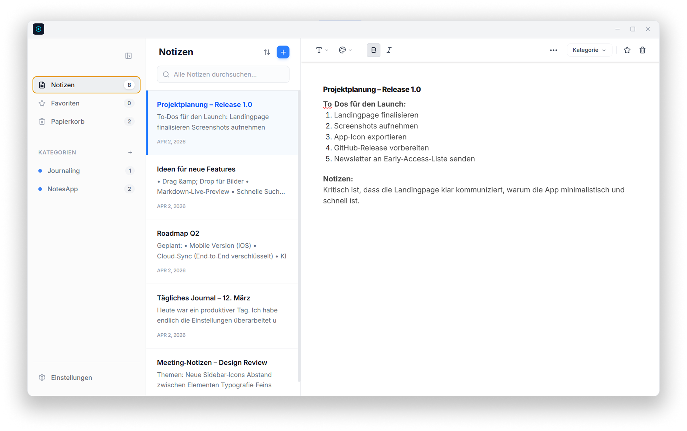

# Notes — Minimalistische, lokale und DSGVO‑konforme Notiz‑App für Windows

Notes ist eine schnelle, moderne und vollständig lokale Notiz‑App für Windows.  
Entwickelt für Menschen, die Wert auf **Privatsphäre**, **Schnelligkeit** und **Fokus** legen — ohne Cloud, ohne Konto, ohne Tracking.

---

## ✨ Features

- **Offline First** – alle Daten bleiben ausschließlich auf deinem Gerät  
- **Privacy‑First** – keine Cloud, kein Tracking, keine Accounts  
- **DSGVO‑konform** – vollständige Datenkontrolle durch lokale Speicherung  
- **Zentrale lokale Datenbank** – ultraschnell & robust  
- **Automatisches Speichern** jeder Änderung  
- **Kategorien & Volltextsuche** – alles sofort finden  
- **Light & Dark Mode** – automatisch oder manuell  
- **Deutsch & Englisch** – vollständige Lokalisierung  
- **Drag & Drop** für Notizen und Kategorien  
- **Minimalistisches Windows‑UI** – klar, schnell, fokussiert  
- **Sofort‑Start** – App öffnet in Millisekunden  
- **Keine Abhängigkeiten** – läuft komplett ohne Internet  

---

## 📦 Download

Lade die aktuelle Version direkt herunter:

👉 **[Notes für Windows herunterladen](https://github.com/fortyninelabs/notes/releases/latest)**

---

## 🛠 Installation

1. Installer herunterladen  
2. Setup ausführen  
3. Notes starten  
4. Schreiben

Keine Registrierung. Keine Cloud. Keine Konfiguration.

---

## 🔒 Datenschutz & DSGVO

Notes ist von Grund auf so entwickelt, dass deine Daten **niemals** dein Gerät verlassen.

- Keine Cloud  
- Keine Telemetrie  
- Keine Analyse‑Tools  
- Keine Accounts  
- Keine externen Server  
- 100% lokal  
- 100% unter deiner Kontrolle  

Damit erfüllt Notes die Anforderungen der DSGVO auf natürliche Weise.

---

## 🗺 Roadmap

- 🔐 Passwortschutz / App‑Lock  
- 🔒 Lokale Verschlüsselung  
- 📝 Erweiterte Markdown‑Features  
- 📤 Export‑Optionen (PDF, Markdown, Text)  
- 🎨 Themes & Personalisierung  
- 🤖 Lokale KI‑Features (On‑Device)  
- 📱 Mobile Version (optional)

---

## 🤝 Feedback

Feedback, Ideen oder Fehler gefunden  
**support@fortyninelabs.com**

---

## 📄 Lizenz

MIT License  
© fortyninelabs

